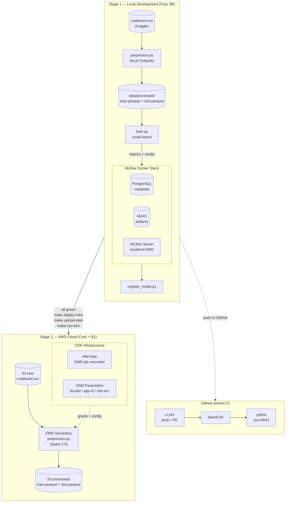

# AWS EMR Credit Card Fraud Detection — MLOps POC

A weekend proof-of-concept demonstrating a production-grade MLOps pipeline for credit card fraud detection using **PySpark on AWS EMR Serverless**, **MLflow tracking**, and **GitHub Actions CI/CD**.

**Design philosophy: Shift Left.** Test everything locally first (zero AWS cost), then promote to cloud after validation.

## Architecture



## Shift-Left Development Flow

```
Local:
  make mlflow-up          # Start Docker stack
  make preprocess-local   # PySpark → data/processed/
  make train-local        # Train model, log to MLflow
  make test               # Unit tests
  make lint               # Flake8

When all local tests pass:
Cloud:
  make deploy-infra       # CDK → S3 + EMR Serverless app
  make upload-data        # Upload CSV to S3
  make run-emr            # Submit EMR job, wait for completion
  make train-local        # Re-train on EMR output (validate results)
```

## Tech Stack

| Component | Technology | Purpose |
|-----------|-----------|---------|
| Data Processing | PySpark 3.5 | Distributed feature engineering |
| ML Model | scikit-learn | Fraud classification (LogisticRegression) |
| Experiment Tracking | MLflow 2.x | Run history, model registry, artifacts |
| Artifact Storage | MinIO (S3-compat) | Local S3 mirror + PostgreSQL backend |
| Infrastructure | AWS CDK (Python) | EMR Serverless, S3, IAM roles, SSM params |
| Cloud Job Compute | AWS EMR Serverless | Serverless PySpark (pay-per-second) |
| CI/CD | GitHub Actions | Lint + pytest on every push (no AWS needed) |

## Quick Start

### Prerequisites

- Python 3.11+
- Docker + Docker Compose
- AWS CLI configured (for cloud deployment)
- Git

### Installation

```bash
# Clone and enter repo
git clone <repo-url>
cd aws_emr_credit_card_fraud_detection

# Install Python dependencies
make setup

# Copy .env
cp .env.example .env
```

### Download Dataset

Download credit card fraud dataset from Kaggle:
```bash
# Manual download from https://www.kaggle.com/datasets/mlg-ulb/creditcardfraud
# Or use kaggle-cli:
pip install kaggle
kaggle datasets download -d mlg-ulb/creditcardfraud
unzip creditcardfraud.zip -d data/
```

### Stage 1: Local (Shift-Left Testing)

```bash
# 1. Start MLflow Docker stack (PostgreSQL + MinIO + MLflow server)
make mlflow-up
# View MLflow UI: http://localhost:5000
# View MinIO console: http://localhost:9001 (user/pass: minioadmin/minioadmin)

# 2. Run preprocessing locally (PySpark)
make preprocess-local
# Output: data/processed/train/ and data/processed/test/

# 3. Train model locally with MLflow tracking
make train-local
# Logs metrics (AUC-ROC, F1, precision, recall) to MLflow
# Confusion matrix plot → MinIO

# 4. Register best model
make register-local
# Model version appears in MLflow Registry

# 5. Run tests (no AWS needed)
make test

# 6. Lint code
make lint

# 7. Clean up
make mlflow-down
```

### Stage 2: Cloud (After Local is Green)

**Setup AWS credentials:**
```bash
export AWS_ACCOUNT_ID=<your-account-id>
export AWS_DEFAULT_REGION=us-west-2
aws configure  # Or use OIDC in GitHub Actions
```

**Deploy infrastructure:**
```bash
# Install CDK dependencies and deploy
make deploy-infra

# Check outputs
aws ssm get-parameter --name /fraud-mlops/dev/bucket-name --region us-west-2
aws ssm get-parameter --name /fraud-mlops/dev/emr-app-id --region us-west-2
```

**Upload data and run EMR job:**
```bash
# Upload creditcard.csv to S3
make upload-data

# Submit PySpark job to EMR Serverless (~3 min runtime)
make run-emr

# Check S3 output
aws s3 ls s3://<bucket>/processed/
```

## Project Structure

```
aws_emr_credit_card_fraud_detection/
├── src/
│   ├── preprocess.py        # PySpark job (local or EMR)
│   └── train.py             # sklearn + MLflow (local)
├── scripts/
│   ├── upload_data.py       # Upload CSV to S3
│   ├── submit_emr_job.py    # Submit EMR Serverless job
│   └── register_model.py    # MLflow model registry
├── tests/
│   ├── test_preprocess.py   # PySpark unit tests
│   └── test_train.py        # Model training tests
├── infra/
│   ├── app.py               # CDK app entry point
│   ├── fraud_detection/
│   │   └── emr_stack.py     # S3 + EMR Serverless + IAM + SSM
│   └── cdk.json
├── mlflow/
│   └── docker-compose.yml   # PostgreSQL + MinIO + MLflow server
├── .github/workflows/
│   └── ci.yml               # Lint + test on push
├── Makefile                 # Development targets
├── requirements.txt         # Python dependencies
└── README.md
```

## Model Details

**Fraud Classification:**
- **Algorithm:** LogisticRegression
- **Class Weight:** Balanced (handles ~0.17% fraud rate)
- **Features:**
  - V1–V28: PCA-transformed features (from raw data)
  - Amount_log: Log-transformed transaction amount
  - Time_sin, Time_cos: Cyclical time encoding
- **Metrics:** AUC-ROC, F1, Precision-Recall (fraud-centric)
- **Train/Test Split:** 80/20 (stratified)

**Example Results (Local):**
```
AUC-ROC: 0.9650
F1:      0.8230
Precision: 0.8900
Recall:  0.7600
```

## MLflow Model Registry

Models are tracked in MLflow with:
- **Experiment:** `fraud-detection`
- **Artifacts:** model.pkl, confusion_matrix.png
- **Registry:** FraudDetectionModel (Staging → Production)
- **Backend:** PostgreSQL (local Docker) / RDS (production)
- **Artifact Store:** MinIO (local) / S3 (production)

Register model after training:
```bash
make register-local
# View: http://localhost:5000/#/models/FraudDetectionModel
```

## GitHub Actions CI

### `ci.yml` — Lint & Test
- **Trigger:** Push or PR to any branch
- **Steps:** flake8 lint, pytest (no AWS credentials needed)
- **Cost:** Free

## Cost Estimate (Weekend Testing)

| Resource | Usage | Cost |
|----------|-------|------|
| EMR Serverless | 3 min × 5 runs | ~$0.05–0.25 |
| S3 | 144MB + outputs (free tier) | $0.00 |
| SSM Parameters | 3 parameters | $0.00 |
| Total | 5–10 test runs | **< $1** |

**Local development:** $0 (Docker only)

## Governance & Auditability

**MLflow Tracking:**
- Run metadata: parameters, metrics, git commit, user
- Artifact lineage: training → model → deployment
- Model Registry: versioning, approval workflow, metadata

**Structured Logging:**
- Class distribution (preprocessing)
- Feature names and transformations
- Model hyperparameters and metrics
- Train/test data shapes and fraud rates

**IAM & RBAC:**
- S3 bucket policies (least privilege)
- EMR job execution role (scoped to bucket + logs)
- GitHub OIDC role (EMR Serverless only, no EC2 access)

## Interview Talking Points

This POC demonstrates:

1. **Shift-Left Development** — All components validated locally before cloud spend
2. **PySpark on EMR Serverless** — Modern, serverless approach; no idle cluster costs
3. **MLflow Governance** — Experiment tracking, model registry, reproducibility
4. **GitHub Actions CI** — Lint + pytest gate on every push (no AWS credentials needed)
5. **AWS CDK IaC** — Infrastructure as code, version-controlled
6. **Class Imbalance Handling** — Domain knowledge (fraud rate ~0.17%, precision-recall > accuracy)
7. **Path-Agnostic Code** — Same PySpark script runs locally and on EMR (no duplication)
8. **Production Architecture Mirroring** — Local Docker stack mirrors production (PostgreSQL + S3)

## Troubleshooting

### MLflow connection fails
```bash
# Check MLflow server is healthy
curl http://localhost:5000/health

# Check MinIO is ready
curl http://localhost:9000/minio/health/live

# Restart stack
make mlflow-down && make mlflow-up
```

### PySpark local tests hang
```bash
# Spark may be stuck in background
pkill -f pyspark

# Re-run with verbose logging
pytest tests/test_preprocess.py -v -s
```

### EMR job submission fails
```bash
# Check SSM parameters exist
aws ssm get-parameters-by-path --path /fraud-mlops/dev --recursive

# Check S3 bucket access
aws s3 ls s3://<bucket>/

# Check EMR job execution role
aws iam get-role --role-name fraud-emr-job-role-dev
```

## References

- [PySpark API](https://spark.apache.org/docs/latest/api/python/)
- [MLflow Documentation](https://mlflow.org/docs/latest/)
- [AWS EMR Serverless](https://docs.aws.amazon.com/emr/latest/EMR-Serverless-UserGuide/)
- [AWS CDK Python Reference](https://docs.aws.amazon.com/cdk/api/v2/python/index.html)

## License

This is a learning/interview POC. Licensed under MIT.

---

**Built for RBC GFT Lead Cloud MLOps Engineer role.**
**Target: demonstrate PySpark, MLflow, GitHub Actions, AWS CDK, and fraud detection domain knowledge.**
